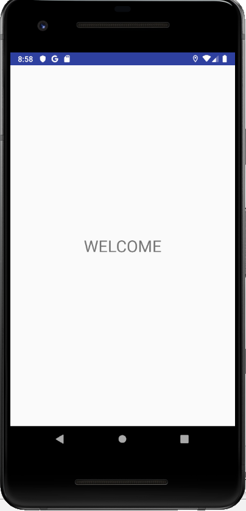
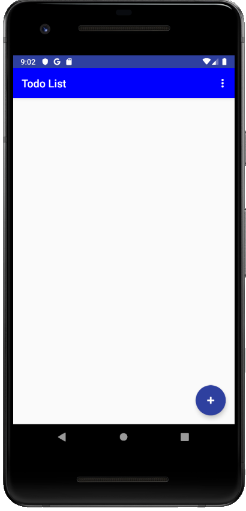
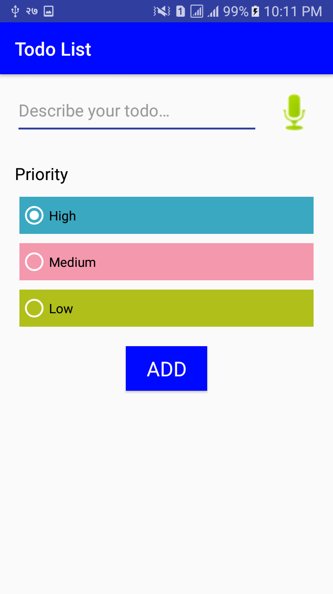
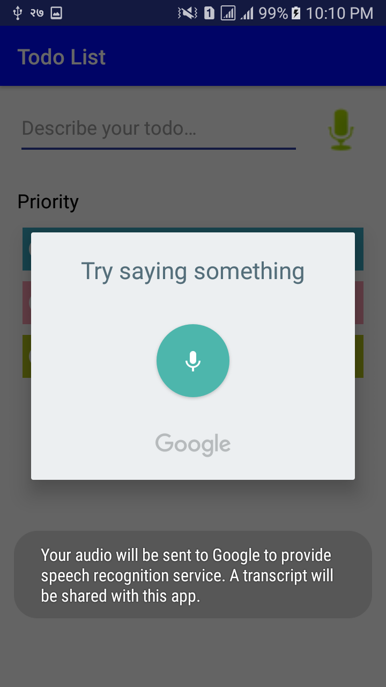
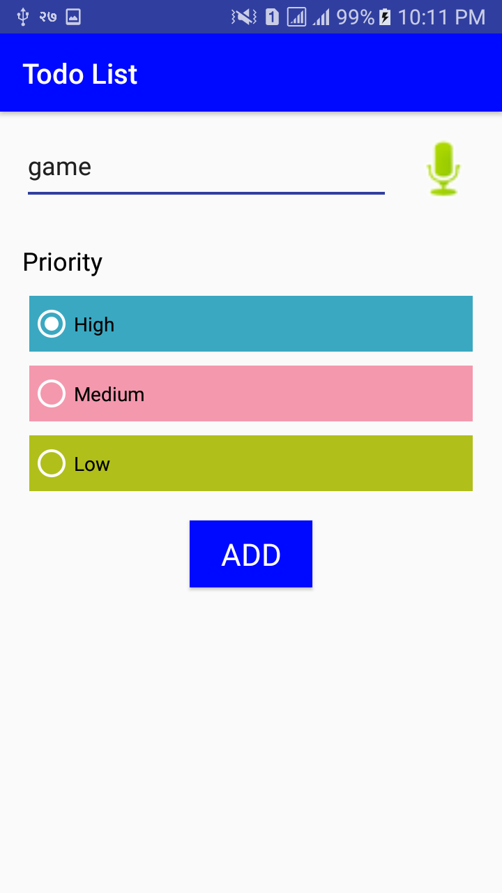
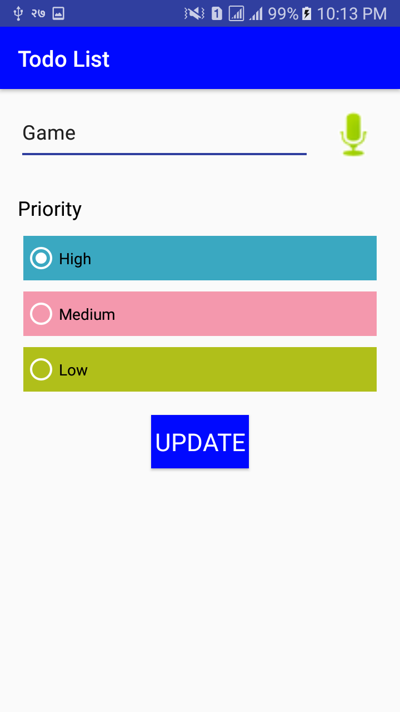
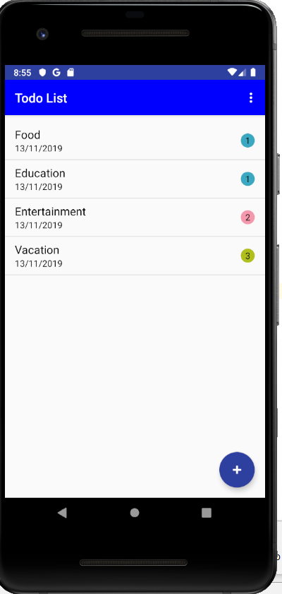
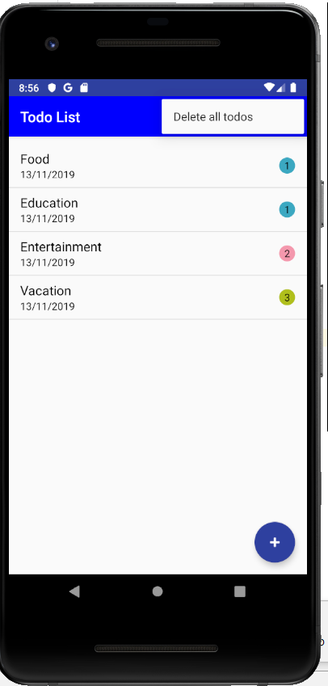
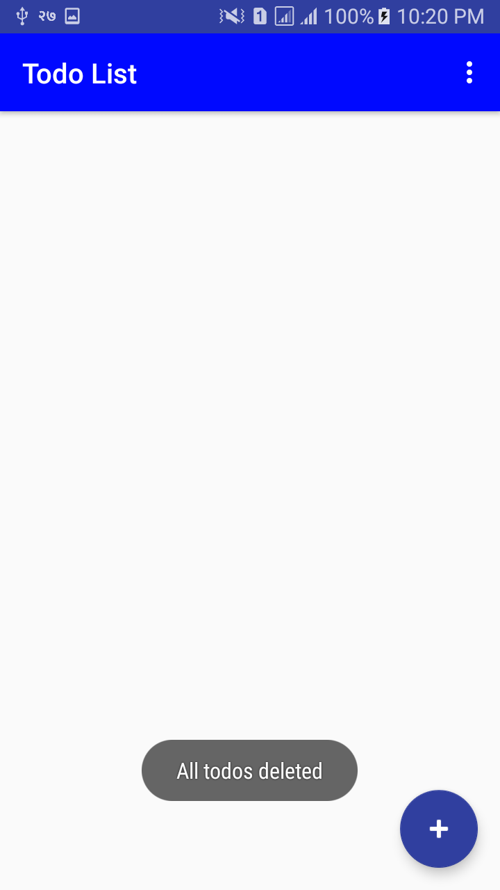
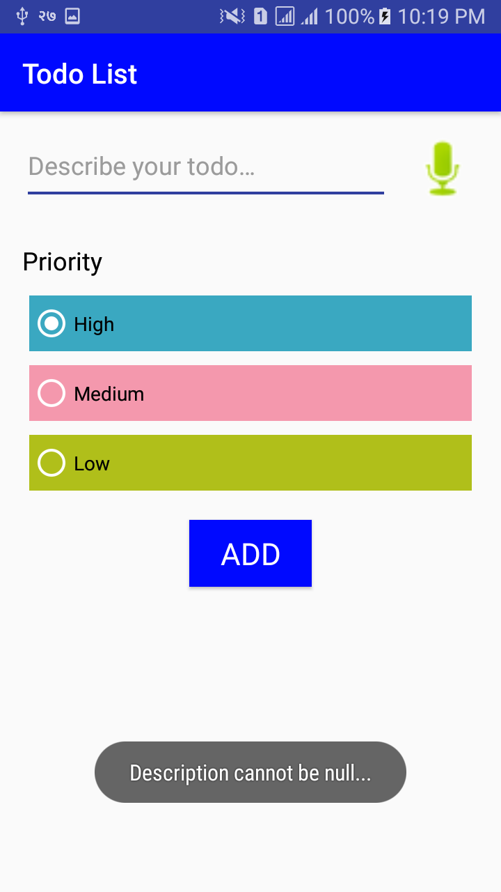

# To-Do App 

TO-DO List is an android application which has basic CRUD operations features and allows user to build a todo list. Basic features include add new tasks, edit and delete an existing task either one or all at once. There are also some extra features like a splash screen, Google’s speech to text service, etc. 

# Features

1.	CRUD functionality
2.	Splash Screen
3.	Speech to Text for adding description of the task

# Framework Used

##### Model View View Model (MVVM)
Model-View-ViewModel (MVVM) is a software design pattern that is structured to separate program logic and user interface controls. MVVM helps to organize code and break programs into modules to make development, updating and reuse of code simpler and faster. 

# Database

SQLlite (Usage of Database Access Object) SQLite is a software library that provides a relational database management system. The lite in SQLite means light weight in terms of setup, database administration, and required resource. SQLite has the following noticeable features: self-contained, serverless, zero-configuration, transactional.

# Android Components

1.	Activity
2.	Fragments
3.	Adapters
4.	Recycler View

# Screen Shots of application

